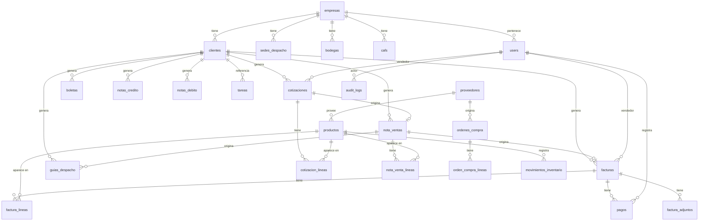

# Database Schema Reference

Reference for Conico's PostgreSQL schema: tables, key columns, FK relationships, cascade rules, and Alembic workflow.

---

## ERD (Mermaid)



---

## Módulo CRM

### `empresas`

| Columna | Tipo | Constraints | Descripción |
|---|---|---|---|
| `id` | INTEGER | PK | |
| `nombre` | VARCHAR | NOT NULL | Razón social |
| `rut` | VARCHAR | UNIQUE | RUT con guion |
| `email` | VARCHAR | | |
| `telefono` | VARCHAR | | |
| `giro` | TEXT | | Actividad comercial |
| `direccion` | TEXT | | Dirección fiscal |
| `linea_credito` | NUMERIC | | Monto máximo de deuda autorizado |
| `plazo_credito` | VARCHAR | | Días de pago (ej. `30`) |
| `created_at` | DATETIME | NOT NULL | |
| `updated_at` | DATETIME | NOT NULL | |

### `clientes`

| Columna | Tipo | Constraints | Descripción |
|---|---|---|---|
| `id` | INTEGER | PK | |
| `nombre` | VARCHAR | NOT NULL | |
| `rut` | VARCHAR | | RUT persona natural |
| `email` | VARCHAR | | |
| `telefono` | VARCHAR | | |
| `empresa_id` | INTEGER | FK → empresas (SET NULL) | Empresa vinculada |
| `direccion_despacho` | TEXT | | Dirección alternativa |
| `recibe_correo` | BOOLEAN | DEFAULT true | Incluir en envíos |
| `notas` | TEXT | | Observaciones internas |
| `created_at` | DATETIME | NOT NULL | |

### `sedes_despacho`

| Columna | Tipo | Constraints | Descripción |
|---|---|---|---|
| `id` | INTEGER | PK | |
| `empresa_id` | INTEGER | FK → empresas (CASCADE) | |
| `nombre` | VARCHAR | NOT NULL | Nombre de la sede |
| `direccion` | VARCHAR | NOT NULL | |

### `users`

| Columna | Tipo | Constraints | Descripción |
|---|---|---|---|
| `id` | INTEGER | PK | |
| `email` | VARCHAR | UNIQUE, NOT NULL | |
| `name` | VARCHAR | NOT NULL | |
| `role` | VARCHAR | NOT NULL | `admin`, `subadmin`, `vendedor` |
| `empresa_id` | INTEGER | FK → empresas | Empresa del usuario |
| `is_active` | BOOLEAN | DEFAULT true | |
| `hashed_password` | VARCHAR | | |
| `totp_secret` | VARCHAR | | Secreto 2FA |
| `created_at` | DATETIME | NOT NULL | |

---

## Módulo de Ventas

### `cotizaciones`

| Columna | Tipo | Constraints | Descripción |
|---|---|---|---|
| `id` | INTEGER | PK | |
| `cliente_id` | INTEGER | FK → clientes (RESTRICT) | |
| `empresa_id` | INTEGER | FK → empresas (SET NULL) | |
| `vendedor_id` | INTEGER | FK → users (RESTRICT) | |
| `estado` | VARCHAR | | `no_definido`, `abierta`, `aprobada`, `cerrada_fv`, `rechazada` |
| `fecha_vencimiento` | DATE | | |
| `total_neto` | NUMERIC | | |
| `total_iva` | NUMERIC | | |
| `total` | NUMERIC | | |
| `notas` | TEXT | | |
| `created_at` | DATETIME | NOT NULL | |

### `cotizacion_lineas`

| Columna | Tipo | Constraints | Descripción |
|---|---|---|---|
| `id` | INTEGER | PK | |
| `cotizacion_id` | INTEGER | FK → cotizaciones (CASCADE) | |
| `producto_id` | INTEGER | FK → productos (SET NULL) | |
| `descripcion` | VARCHAR | NOT NULL | |
| `cantidad` | NUMERIC | NOT NULL | |
| `precio_unitario` | NUMERIC | NOT NULL | |
| `descuento` | NUMERIC | DEFAULT 0 | Porcentaje |
| `margen` | NUMERIC | | Margen calculado |

### `nota_ventas`

| Columna | Tipo | Constraints | Descripción |
|---|---|---|---|
| `id` | INTEGER | PK | |
| `cotizacion_id` | INTEGER | FK → cotizaciones (SET NULL) | Origen cotización |
| `cliente_id` | INTEGER | FK → clientes (RESTRICT) | |
| `empresa_id` | INTEGER | FK → empresas (SET NULL) | |
| `vendedor_id` | INTEGER | FK → users (SET NULL) | |
| `sede_despacho_id` | INTEGER | FK → sedes_despacho (SET NULL) | |
| `estado` | VARCHAR | | `pendiente`, `despachada`, `entregada`, `pagada` |
| `fecha` | DATE | NOT NULL | |
| `total_neto` | NUMERIC | | |
| `total` | NUMERIC | | |

---

## Módulo DTE

### `facturas`

| Columna | Tipo | Constraints | Descripción |
|---|---|---|---|
| `id` | INTEGER | PK | |
| `nv_id` | INTEGER | FK → nota_ventas (SET NULL) | NV de origen |
| `cotizacion_id` | INTEGER | FK → cotizaciones (SET NULL) | |
| `cliente_id` | INTEGER | FK → clientes (SET NULL) | |
| `empresa_id` | INTEGER | FK → empresas (SET NULL) | |
| `vendedor_id` | INTEGER | FK → users (SET NULL) | |
| `banco_receptor_id` | INTEGER | FK → banco_receptores (SET NULL) | |
| `estado` | VARCHAR | | `emitida`, `pagada`, `anulada` |
| `dte_estado` | VARCHAR | | `no_emitida`, `pendiente`, `procesando`, `aceptada`, `rechazada` |
| `folio` | INTEGER | | Número DTE asignado |
| `tipo_dte` | INTEGER | | `33` (factura), `39` (boleta), etc. |
| `fecha` | DATE | NOT NULL | |
| `total_neto` | NUMERIC | | |
| `total_iva` | NUMERIC | | |
| `total` | NUMERIC | | |
| `metodo_pago` | VARCHAR | | |
| `plazo_pago` | VARCHAR | | |

### `boletas`

Estructura análoga a `facturas` para tipo DTE 39/41. FK a `clientes` (SET NULL), `empresas` (SET NULL), `users` (SET NULL).

### `guias_despacho`

Estructura análoga a `facturas` para tipo DTE 52. FK a `nota_ventas` (SET NULL), `clientes` (SET NULL), `empresas` (SET NULL).

### `notas_credito` / `notas_debito`

DTE tipos 61/56 respectivamente. FK a `clientes` y al documento que referencian (`facturas`, `boletas` o `guias_despacho`).

### `cafs`

| Columna | Tipo | Constraints | Descripción |
|---|---|---|---|
| `id` | INTEGER | PK | |
| `empresa_id` | INTEGER | FK → empresas (CASCADE), indexed | |
| `tipo_dte` | INTEGER | NOT NULL | Tipo de documento |
| `folio_desde` | INTEGER | NOT NULL | Primer folio autorizado |
| `folio_hasta` | INTEGER | NOT NULL | Último folio autorizado |
| `folio_actual` | INTEGER | NOT NULL | Próximo folio a usar |
| `fecha_vencimiento` | DATE | | |
| `activo` | BOOLEAN | DEFAULT true | |

### `pagos`

| Columna | Tipo | Constraints | Descripción |
|---|---|---|---|
| `id` | INTEGER | PK | |
| `factura_id` | INTEGER | FK → facturas (RESTRICT), indexed | |
| `user_id` | INTEGER | FK → users (SET NULL) | Quien registró |
| `monto` | NUMERIC | NOT NULL | |
| `fecha` | DATE | NOT NULL | |
| `metodo` | VARCHAR | | Transferencia, efectivo, etc. |
| `nota` | VARCHAR | | Referencia / número de transferencia |

---

## Módulo de Inventario

### `productos`

| Columna | Tipo | Constraints | Descripción |
|---|---|---|---|
| `id` | INTEGER | PK | |
| `codigo` | VARCHAR | UNIQUE | SKU interno |
| `nombre` | VARCHAR | NOT NULL | |
| `descripcion` | TEXT | | |
| `precio` | NUMERIC | | Precio de venta |
| `costo` | NUMERIC | | Costo de compra |
| `stock` | INTEGER | DEFAULT 0 | Stock actual |
| `proveedor_id` | INTEGER | FK → proveedores (SET NULL) | |
| `marca_id` | INTEGER | FK → marcas (SET NULL) | |
| `activo` | BOOLEAN | DEFAULT true | |

### `bodegas`

| Columna | Tipo | Constraints | Descripción |
|---|---|---|---|
| `id` | INTEGER | PK | |
| `empresa_id` | INTEGER | FK → empresas (CASCADE), indexed | |
| `nombre` | VARCHAR | NOT NULL | |

### `movimientos_inventario`

| Columna | Tipo | Constraints | Descripción |
|---|---|---|---|
| `id` | INTEGER | PK | |
| `producto_id` | INTEGER | FK → productos (RESTRICT) | |
| `user_id` | INTEGER | FK → users (SET NULL) | |
| `tipo` | VARCHAR | NOT NULL | `entrada`, `salida`, `ajuste` |
| `cantidad` | INTEGER | NOT NULL | |
| `motivo` | VARCHAR | | Referencia (NV, OC, ajuste) |
| `created_at` | DATETIME | NOT NULL | |

---

## Módulo de Compras

### `ordenes_compra`

FK a `proveedores` (RESTRICT). Líneas en `orden_compra_lineas` con FK a `productos` (SET NULL).

### `proveedores`

Tabla maestra de proveedores. FK referenciada desde `productos` y `ordenes_compra`.

---

## Módulo de Aprobaciones

### `aprobaciones_credito`

| Columna | Tipo | Constraints |
|---|---|---|
| `id` | INTEGER | PK |
| `empresa_id` | INTEGER | FK → empresas (SET NULL) |
| `cotizacion_id` | INTEGER | FK → cotizaciones (SET NULL) |
| `nv_id` | INTEGER | FK → nota_ventas (SET NULL) |
| `solicitante_id` | INTEGER | FK → users (SET NULL) |
| `aprobador_id` | INTEGER | FK → users (SET NULL) |
| `estado` | VARCHAR | `pendiente`, `aprobada`, `rechazada` |
| `monto_solicitado` | NUMERIC | |

### `aprobacion_margen`

Estructura análoga para aprobaciones de margen bajo en cotizaciones.

---

## Módulo de Tareas

### `tareas`

Polimórfica — puede referenciar cualquier entidad:

| FK | Tabla destino | ondelete |
|---|---|---|
| `asignado_a` (users) | users | RESTRICT |
| `cliente_id` | clientes | SET NULL |
| `empresa_id` | empresas | SET NULL |
| `cotizacion_id` | cotizaciones | SET NULL |
| `nv_id` | nota_ventas | SET NULL |
| `factura_id` | facturas | SET NULL |
| `producto_id` | productos | SET NULL |

---

## Auditoría y Telemetría

### `audit_logs`

| Columna | Tipo | Descripción |
|---|---|---|
| `id` | INTEGER | PK |
| `user_id` | INTEGER | FK → users (SET NULL) |
| `action` | VARCHAR | Acción realizada |
| `entity_type` | VARCHAR | Tabla afectada |
| `entity_id` | INTEGER | ID del registro |
| `changes` | JSON | Antes/después |
| `created_at` | DATETIME | |

`audit_log_archive` tiene estructura idéntica para registros históricos.

### `perf_rollup` / `cost_rollup`

Agregados de performance y costos para el dashboard de administración. Sin FKs externas.

---

## Reglas de cascade — resumen

| Patrón | Efecto | Uso |
|---|---|---|
| `ondelete="CASCADE"` | Borra hijos al borrar padre | Líneas de documentos, CAFs de empresa |
| `ondelete="RESTRICT"` | Bloquea borrado si hay hijos | Cliente con cotizaciones, producto con stock |
| `ondelete="SET NULL"` | Desvincula hijos, no los borra | Vendedor eliminado en documentos históricos |

---

## Flujo Alembic

### Generar una migración

```bash
# Asegúrate de que los modelos están importados en alembic/env.py
alembic revision --autogenerate -m "descripcion_del_cambio"
```

Revisa el archivo generado en `alembic/versions/` antes de aplicar.

### Aplicar migraciones

```bash
# Aplicar todas las migraciones pendientes
alembic upgrade head

# Aplicar hasta una revisión específica
alembic upgrade <revision_id>
```

### Rollback

```bash
# Revertir la última migración
alembic downgrade -1

# Revertir a una revisión específica
alembic downgrade <revision_id>

# Revertir todo (estado vacío)
alembic downgrade base
```

### Verificar estado actual

```bash
# Ver la revisión aplicada actualmente
alembic current

# Ver revisión HEAD esperada
alembic heads

# Ver historial completo
alembic history --verbose
```

Si `alembic current` muestra una revisión distinta a `alembic heads`, hay migraciones pendientes. Aplica con `upgrade head`.

### En tests

Los tests usan SQLite en memoria (`test.db`). Alembic no se ejecuta — SQLAlchemy crea las tablas directamente con `Base.metadata.create_all()`. Las migraciones solo aplican a PostgreSQL en dev/prod.
