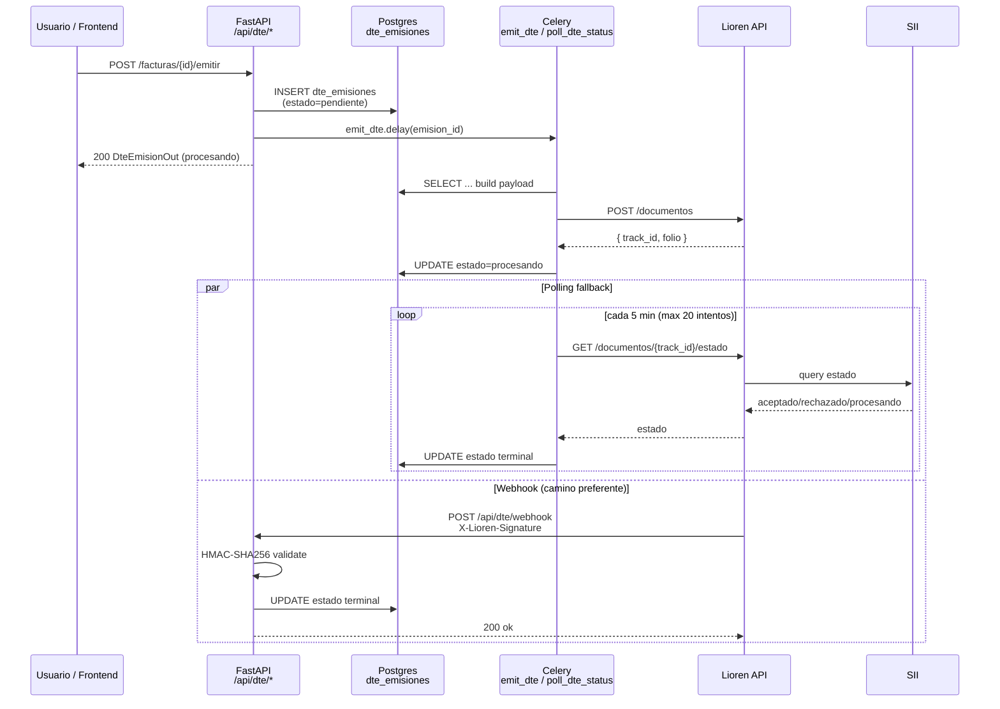

# DTE/Lioren Integration — Deep Dive

> **Audiencia:** desarrolladores internos y partners que integran o extienden la emisión DTE.
> **Estado:** documento canónico. Última revisión: 2026-05-06.
> **Mantener sincronizado con:** `backend/app/services/dte_service.py`, `backend/app/tasks/dte.py`, `backend/app/api/dte.py`, `backend/app/services/lioren_metrics.py`.

Conico emite documentos tributarios electrónicos (DTE) al SII a través de [Lioren](https://lioren.cl) como provider intermedio. Este documento describe cómo funciona la integración punta a punta: autenticación, tipos DTE soportados, flujo asíncrono (Celery + webhook + polling), validación HMAC, gestión de CAF, y casos de anulación.

Si un comportamiento aquí descrito ya no coincide con el código, el código gana — actualiza este documento al mismo PR.

---

## Tabla de contenidos

1. [Arquitectura general](#1-arquitectura-general)
2. [Configuración y autenticación](#2-configuración-y-autenticación)
3. [Tipos DTE soportados y payloads](#3-tipos-dte-soportados-y-payloads)
4. [Flujo de emisión (estado a estado)](#4-flujo-de-emisión-estado-a-estado)
5. [Webhook Lioren — endpoint, HMAC y idempotencia](#5-webhook-lioren--endpoint-hmac-y-idempotencia)
6. [Polling de estado (Celery beat)](#6-polling-de-estado-celery-beat)
7. [Anulación: Notas de Crédito (DTE 61)](#7-anulación-notas-de-crédito-dte-61)
8. [Gestión de CAF (folios)](#8-gestión-de-caf-folios)
9. [Libros de Ventas / Compras (envío mensual)](#9-libros-de-ventas--compras-envío-mensual)
10. [Telemetría y costo](#10-telemetría-y-costo)
11. [Errores comunes y troubleshooting](#11-errores-comunes-y-troubleshooting)

---

## 1. Arquitectura general



**Componentes clave:**

| Capa | Archivo | Rol |
|---|---|---|
| Service (httpx + payload builders) | `backend/app/services/dte_service.py` | Construye el payload por tipo DTE, hace `POST /documentos`, valida firma webhook, expone `DteService` instanciable. |
| Celery tasks | `backend/app/tasks/dte.py` | `emit_dte` (con retry exponencial), `poll_dte_status` (cron 300s), mapeo `lioren_estado → estado interno`, sincronización en cascada del estado en el documento padre. |
| API REST | `backend/app/api/dte.py` | Endpoints `/emitir` para Factura, NC, ND, Guía; webhook `/api/dte/webhook`; CRUD básico de NC/ND. |
| Telemetría | `backend/app/services/lioren_metrics.py` | Context manager `lioren_call(...)` que mide latencia, status, tamaños, costo por slug y emite `lioren.call` a loguru + Redis (cost events). |
| CAF | `backend/app/services/caf_service.py`, `backend/app/api/onboarding_cafs.py` | Parsing de XML CAF (SII), detección de overlaps, alertas `>=90%` consumido / `<30 días` vencimiento. |

> **Nota:** Conico **no** consulta la tabla `cafs` antes de emitir. La asignación de folios la hace Lioren del lado del provider y los devuelve en el response. La tabla `cafs` local existe solo para visualizar inventario y alertas en el panel admin.

---

## 2. Configuración y autenticación

### 2.1 Variables de entorno

Definidas en `backend/app/config.py` (Pydantic settings, prefijo automático `LIOREN_`):

| Variable | Default | Descripción |
|---|---|---|
| `LIOREN_API_URL` | `https://api.lioren.cl/v1` | Base URL. Override para sandbox: `https://sandbox.lioren.cl/v1` (ver Lioren docs). |
| `LIOREN_API_KEY` | `""` | API key bearer token. Obtener desde el panel Lioren del cliente; **no commitear**. |
| `LIOREN_WEBHOOK_SECRET` | `""` | Secreto compartido para HMAC-SHA256 del webhook. Configurar tanto en Conico como en Lioren al mismo valor. |

`docs/environment-variables.md` es la referencia canónica de variables; este documento solo describe el subset Lioren.

### 2.2 Headers HTTP

`DteService._headers()` produce:

```python
{
    "Authorization": f"Bearer {api_key}",
    "Content-Type": "application/json",
}
```

No hay refresh token: la API key es permanente hasta rotación manual desde el panel Lioren. Si Lioren retorna `401`, los Celery retries de `emit_dte` (max 3, backoff exponencial `60 * 2**retries`) la reintentarán pero no se auto-resuelven sin rotar la key.

### 2.3 Instanciación

```python
from app.services.dte_service import get_dte_service
svc = get_dte_service()  # lee app.config.settings — singleton implícito por Settings()
```

Para tests, instanciar directamente con valores fake:

```python
DteService(api_key="test", api_url="http://stub", webhook_secret="hmac-secret")
```

---

## 3. Tipos DTE soportados y payloads

Los siguientes tipos están implementados con su builder en `dte_service.py`:

| Código DTE | Builder | Documento | Notas |
|---|---|---|---|
| `33` | `build_factura_payload` (`tipo_int=33`) | Factura Electrónica | Calcula IVA 19% sobre `total_neto`. |
| `34` | `build_factura_payload` (`tipo_int=34`) | Factura Exenta | Usa `monto_exento` en totales (sin IVA). |
| `39` | `build_boleta_payload` | Boleta Electrónica | IVA 19%; receptor por defecto `66666666-6 / Consumidor Final` si la boleta no tiene cliente. |
| `41` | `build_boleta_payload` | Boleta Exenta | `tasa_iva=0`. |
| `46` | `build_factura_compra_payload` | Factura de Compra | Receptor = proveedor. |
| `52` | `build_guia_payload` | Guía de Despacho | **Estado:** campos `ind_traslado` y `destino` son hipótesis sin validar contra Lioren sandbox (ver TODO `W1-05-sandbox` en el código). NO descuenta stock al rechazar (a diferencia de boleta). |
| `56` | `build_nd_payload` | Nota de Débito | Tipo fijo 56. |
| `61` | `build_nc_payload` | Nota de Crédito | Tipo fijo 61. Si está vinculada a `guia_despacho_id`, su aceptación marca la guía como `anulada`. |

### 3.1 Forma genérica del payload

Todos los builders producen un dict con esta forma. Los detalles por tipo viven en cada builder:

```json
{
  "tipo_dte": 33,
  "fecha_emision": "2026-05-06",
  "emisor": {
    "rut": "76.123.456-7",
    "razon_social": "Mi Empresa SpA",
    "giro": "Servicios informáticos",
    "direccion": "Av. Providencia 1234",
    "ciudad": "Santiago",
    "comuna": "Providencia"
  },
  "receptor": {
    "rut": "12.345.678-9",
    "razon_social": "Cliente Final",
    "giro": "",
    "direccion": "...",
    "ciudad": "...",
    "comuna": "..."
  },
  "detalle": [
    {
      "nombre": "Producto A",
      "cantidad": 2.0,
      "precio_unitario": 10000,
      "descuento_porcentaje": 0
    }
  ],
  "totales": {
    "monto_neto": 20000,
    "tasa_iva": 19,
    "iva": 3800,
    "monto_total": 23800
  },
  "referencias": [
    { "tipo": "33", "folio": "42", "fecha": "2026-04-30", "razon": "..." }
  ]
}
```

Variantes:

- **Boleta (39/41):** `detalle[].exenta` (bool); si la boleta tiene `patente_vehiculo`, se agrega `referencias=[{"tipo":"PATENTE","valor":"..."}]`.
- **Factura exenta (34):** `totales = { monto_exento, monto_total }` (sin IVA).
- **NC (61) y ND (56):** incluyen campo `razon` (string) a nivel raíz.
- **Guía 52:** agrega `ind_traslado` (1..9 según `motivo_traslado`) y `destino: { direccion, comuna }`.
- **Factura compra (46):** receptor = proveedor (no cliente).

El emisor se lee de `system_config` por keys: `rut_emisor`, `razon_social_emisor`, `giro_emisor`, `direccion_emisor`, `ciudad_emisor`, `comuna_emisor`. La función `_get_config(db)` lo materializa en un dict.

### 3.2 Validación previa

Conico **no** valida estructuralmente el payload antes de enviarlo a Lioren. Si el documento es inválido:

- Lioren responde 4xx → `httpx.raise_for_status()` levanta excepción → Celery reintenta hasta `max_retries=3` con backoff `60s, 120s, 240s` → al agotarse, marca `estado=rechazada` y el documento padre vía `_sync_dte_estado()`.
- Para boletas (no para guías), si el SII rechaza después, `_sync_dte_estado` revierte el stock automáticamente (`revertir_stock_boleta` en `boleta_stock.py`) y marca `boleta.estado='anulada'`.

---

## 4. Flujo de emisión (estado a estado)

### 4.1 Estados de `dte_emisiones.estado`

```
pendiente → procesando → aceptada
                       ↘ rechazada
                       ↘ timeout      (>= 20 polls sin respuesta terminal)
```

### 4.2 Estado del documento padre (`factura.dte_estado`, `boleta.dte_estado`, etc.)

El código mapea Lioren → interno en `tasks/dte.py::_lioren_to_estado()`:

| Lioren retorna | Estado interno |
|---|---|
| `aceptado` / `aceptada` | `aceptada` |
| `rechazado` / `rechazada` | `rechazada` |
| `procesando` / `en_proceso` | `procesando` |
| (cualquier otro) | `procesando` (default) |

Y replica el estado al documento padre vía `_sync_dte_estado()` (factura, NC, ND, boleta, guía o factura de compra). Casos especiales:

- **NC aceptada con `guia_despacho_id` set:** la guía pasa a `estado='anulada'` (regla D-16).
- **Boleta rechazada:** revierte stock vía `revertir_stock_boleta` y marca la boleta como `anulada`. Idempotente: solo si `previous_estado != 'rechazada'`.
- **Guía rechazada:** NO revierte stock (regla D-12/D-13: la guía 52 nunca descuenta stock).

### 4.3 Endpoints `/emitir`

Todos los endpoints `/emitir` siguen este patrón (ver `api/dte.py`):

```python
# 1. Validar que el documento existe
# 2. Validar dte_estado == "no_emitida"  (409 si no)
# 3. Validar que no hay DteEmision previa  (409 si no)
# 4. Crear DteEmision(estado="pendiente")
# 5. Marcar documento padre dte_estado="pendiente"
# 6. db.commit()
# 7. emit_dte.delay(emision.id)  ← Celery
# 8. Return 200 con DteEmisionOut
```

| Endpoint | Documento | Permission | Modulo |
|---|---|---|---|
| `POST /api/dte/facturas/{id}/emitir` | Factura | `facturas:create` | `facturas` |
| `POST /api/dte/notas-credito/{id}/emitir` | Nota Crédito | `facturas:create` | `nota_credito` |
| `POST /api/dte/notas-debito/{id}/emitir` | Nota Débito | `facturas:create` | `nota_debito` |
| `POST /api/dte/guias-despacho/{id}/emitir` | Guía de Despacho | `guias_despacho:create` | `guias_despacho` |

> **Boletas:** no hay endpoint `/emitir` separado. La emisión DTE se encola dentro de `POST /api/boletas/` (creación) después de `descontar_stock_boleta` y antes del return. El service y la tarea `emit_dte` son los mismos. Para facturas-compra: `POST /api/facturas-compra/{id}/emitir`.

### 4.4 Reintentos y backoff

`emit_dte` (Celery, `max_retries=3`):

```python
countdown = 60 * (2 ** self.request.retries)
# Intento 1 falla → reintento a los 60s
# Intento 2 falla → reintento a los 120s
# Intento 3 falla → reintento a los 240s
# 4 fallos → MaxRetriesExceededError → estado=rechazada
```

Al agotarse retries, `respuesta_sii = {"error": "Max retries exceeded"}` y se sincroniza el documento padre.

---

## 5. Webhook Lioren — endpoint, HMAC y idempotencia

**Endpoint:** `POST /api/dte/webhook` (público — no requiere auth de usuario, autenticado por HMAC).

### 5.1 Validación HMAC

Lioren envía la firma en el header `X-Lioren-Signature` como hex digest:

```python
# backend/app/services/dte_service.py:376
def validate_webhook_signature(self, body: bytes, signature: str) -> bool:
    expected = hmac.new(
        self.webhook_secret.encode(),
        body,
        hashlib.sha256,
    ).hexdigest()
    return hmac.compare_digest(expected, signature)
```

- Algoritmo: **HMAC-SHA256** (hex digest, no base64).
- Cuerpo firmado: el `request.body()` raw (bytes), no el JSON parseado.
- Comparación timing-safe (`hmac.compare_digest`).
- Falla → `403 Invalid webhook signature`.

### 5.2 Body esperado

```json
{
  "track_id": "lioren-track-id-abc123",
  "estado": "aceptado",
  "folio": 42,
  "rechazo_motivo": "...",
  "_extras": "..."
}
```

Solo `track_id` y `estado` son obligatorios. El body completo se persiste en `dte_emisiones.respuesta_sii` (JSON) para auditoría / debugging.

### 5.3 Idempotencia

```python
# backend/app/api/dte.py:332
# Don't overwrite terminal states
if emision.estado in ("aceptada", "rechazada"):
    return {"ok": True}
```

Si el webhook llega después de que el polling ya cerró el caso, se ignora silenciosamente (HTTP 200) — Lioren reintentará el webhook si recibe error, así que devolver 200 es correcto.

### 5.4 Track ID no encontrado

Si `data.track_id` no existe en `dte_emisiones`, también `200 OK` silencioso. No es un error: puede ser un evento de un tenant distinto o un track_id ya borrado.

---

## 6. Polling de estado (Celery beat)

### 6.1 Schedule

`backend/app/celery_app.py`:

```python
beat_schedule = {
    "poll-dte-status": {
        "task": "app.tasks.dte.poll_dte_status",
        "schedule": 300.0,  # cada 5 minutos
    },
    ...
}
```

### 6.2 Lógica

Cada tick:

1. Selecciona todas las `dte_emisiones` con `estado='procesando'` y `intentos_poll < 20`.
2. Para cada una con `track_id` no nulo: `GET /documentos/{track_id}/estado`.
3. Si Lioren retorna estado terminal (`aceptada`/`rechazada`):
   - Actualiza `estado`, `respuesta_sii`, `aceptado_at` (si aceptada).
   - Llama `_sync_dte_estado()` para propagar al documento padre.
4. Si Lioren retorna `procesando`: incrementa `intentos_poll`.
5. Si la llamada httpx lanza excepción: incrementa `intentos_poll`, no se reintenta inmediatamente.
6. Si `intentos_poll >= 20`: marca `estado='timeout'` (esto ocurre **dentro del mismo tick**, después del loop principal).

**Tiempo máximo en `procesando`:** `20 polls × 5 min = ~100 minutos` antes de pasar a `timeout`. Después de eso solo el webhook puede cerrar el caso (no hay reset automático del contador).

### 6.3 Race con webhook

Tanto el webhook como el polling actualizan la misma fila. Sin lock explícito, el "primero que llegue gana" — pero ambos verifican `estado not in ("aceptada", "rechazada")` antes de escribir, así que el segundo es no-op.

> **Caso edge:** si el webhook llega y el polling está ejecutándose en paralelo, ambos pueden escribir. SQLAlchemy aplica isolation por defecto (REPEATABLE READ en Postgres), pero la lógica de "no overwrite terminal" depende de leer y luego escribir en la misma transacción, sin SELECT FOR UPDATE. En la práctica el riesgo es bajo (estados terminales son monotónicos) pero está documentado como deuda.

---

## 7. Anulación: Notas de Crédito (DTE 61)

En SII, anular un DTE emitido se hace emitiendo una NC tipo 61 que referencia al documento original. Conico modela esto así:

### 7.1 Anulación de Boleta

La regla D-* del modelo de boleta dice que rechazar SII = anular boleta + revertir stock. Para anulación voluntaria (no por rechazo SII):

1. El operador crea una NC de tipo 61 que apunta a la boleta vía `referencias_docs`.
2. Emite la NC (`POST /api/dte/notas-credito/{id}/emitir`).
3. Cuando la NC llega a `aceptada`, el estado de la boleta original NO cambia automáticamente — la anulación se documenta a nivel SII pero el flag en la boleta queda igual. Esto se trabaja a nivel de UI (mostrar "Anulada via NC #N").

### 7.2 Anulación de Guía (DTE 52)

Específico, codificado en `_sync_dte_estado()`:

```python
if emision.nota_credito_id:
    nc = db.get(NotaCredito, ...)
    nc.dte_estado = estado
    if estado == "aceptada" and nc.guia_despacho_id:
        guia = db.get(GuiaDespacho, nc.guia_despacho_id)
        guia.estado = "anulada"   # ← regla D-16
```

Cuando una NC asociada a una guía es **aceptada por SII**, la guía se marca como anulada automáticamente. Si SII rechaza la NC, la guía queda intacta.

### 7.3 Anulación de Factura

Mismo patrón: NC tipo 61 con `referencias_docs` apuntando a la factura original. La factura mantiene su `dte_estado='aceptada'` pero la NC documenta la anulación a SII. Reportes y libros consideran la NC.

### 7.4 Plazos legales

SII permite emitir NC dentro de los plazos definidos en la normativa (típicamente meses, según el motivo). Conico no enforza el plazo — esto es responsabilidad del operador. Ver runbook `docs/runbooks/boleta-dte-troubleshooting.md` para casos atascados.

---

## 8. Gestión de CAF (folios)

### 8.1 Modelo de datos

`backend/app/models/caf.py`:

```python
class CAF(Base):
    empresa_id: int
    tipo_dte: str            # "33", "39", "52", etc. (sin prefijo "0")
    num_inicio: int
    num_fin: int
    archivo_xml: str         # XML completo del SII almacenado en DB
    vigente: bool
    consumido: int           # contador manual (NO se incrementa automáticamente)
    fecha_vencimiento: date | None
```

Constraints:

- `UNIQUE(empresa_id, tipo_dte, num_inicio)` — no se puede subir el mismo CAF dos veces.
- `CHECK(num_fin > num_inicio)`.
- Detección de overlaps (`caf_service.check_overlap`): `NOT (existing.fin < new.inicio OR existing.inicio > new.fin)`.

### 8.2 Subida (onboarding)

**Endpoint:** `POST /api/onboarding/cafs` (admin only). Multi-file (`files: List[UploadFile]`).

Por archivo:

1. Validar extensión `.xml`.
2. Leer + decode UTF-8.
3. Parsear via `parse_caf_xml()`:
   - Extrae `RUT_EMISOR`, lista de `TIPO_FOLIO` (TIPO + DESDE + HASTA + FOLIO_VIGENCIA), y firma `FRMA`.
4. Verificar duplicado exacto (`empresa_id + tipo_dte + num_inicio + num_fin`). Si existe, retorna su id sin error.
5. `validate_caf()` corre overlap detection + verifica que `FRMA` exista (firma básica, NO verifica RSA contra cert raíz SII — ver §8.4).
6. INSERT con `vigente=True`, `consumido=0`, `fecha_vencimiento` derivada del primer `FOLIO_VIGENCIA` parseado.

### 8.3 Alertas (`/api/cafs/alerts/`)

Reglas (`api/cafs.py`):

- **Low stock:** `consumido / total >= 0.9` (90%).
- **Expiring soon:** `fecha_vencimiento - today < 30 días`.
- **Urgencia:** `ambos > vencimiento > stock`.

Tarea Celery `app.tasks.caf.send_caf_alerts_email` corre diariamente (`crontab(hour=8, minute=30)`) y envía email a admins de la empresa.

### 8.4 Limitaciones conocidas

- **Validación de firma simplificada:** `validate_signature()` solo confirma que `<FRMA>` existe y no está vacío. NO verifica RSA-SHA1 contra el certificado raíz del SII. Para producción crítica se recomienda implementar via `pySII` o LibreOffice UNO API (ver TODO en el código).
- **`consumido` no se auto-incrementa:** el contador local NO se actualiza al emitir un DTE. Lioren maneja la asignación de folios del lado del provider; Conico solo conoce el folio retornado en el response. El operador puede actualizar `consumido` manualmente en SQL o se actualiza periódicamente desde el panel admin (no automático en este momento — deuda documentada).
- **Rollover automático:** No existe. Cuando un CAF llega al 100%, las emisiones siguen funcionando porque Lioren puede tener su propio CAF asignado o el operador subió otro. La alerta a 90% es la única señal.

---

## 9. Libros de Ventas / Compras (envío mensual)

`DteService.submit_libro(tipo, payload)` envía a `POST /libros/{tipo}` (donde `tipo ∈ {"ventas", "compras"}`).

Builders:

```python
# Ventas
{
    "rut_emisor": "...",
    "periodo": "2026-04",
    "tipo_operacion": "VENTA",
    "detalles": [...]   # poblado desde dte_emisiones del periodo
}
```

El servicio `LibroService` (`backend/app/services/libro_service.py`) genera o recupera el libro idempotentemente por `(empresa_id, periodo)`. La submission a SII se hace vía Lioren cuando el libro está "listo" (lógica en `api/libros.py`).

Tarifa: tracked como slug `libro_envio` en `cost_tariff` (no por tipo).

---

## 10. Telemetría y costo

Cada llamada httpx a Lioren está envuelta en el context manager `lioren_call()` (`backend/app/services/lioren_metrics.py`):

```python
with lioren_call(url, "POST", empresa_id=empresa_id, dte_tipo="033", db=db, req_size=len(body)) as state:
    resp = httpx.post(url, json=payload, headers=headers, timeout=30.0)
    state["status"] = resp.status_code
    state["resp_size"] = len(resp.content)
```

Al salir, emite log estructurado (loguru, key `"lioren.call"`) con:

| Campo | Tipo | Descripción |
|---|---|---|
| `endpoint` | str | URL completa. |
| `method` | str | `GET`, `POST`. |
| `latency_ms` | int | Wallclock del bloque. |
| `http_status` | int | Status HTTP (None si excepción antes de respuesta). |
| `req_size`, `resp_size` | int | Bytes. |
| `empresa_id` | int \| None | Multi-tenant attribution (futuro). |
| `dte_tipo` | str \| None | `033`, `061`, etc. |
| `cost_clp` | int | Costo estimado en CLP, lookup por slug en `cost_tariff` (ver `docs/operations/lioren_cost_maintenance.md` para mapping y actualización de tarifas). |

Además, push a Redis list `conico:cost_events` para agregación horaria (telemetry pipeline — ver `app/tasks/telemetry.py::aggregate_cost_hourly`, scheduled `crontab(minute=10)`).

---

## 11. Errores comunes y troubleshooting

| Síntoma | Causa probable | Acción |
|---|---|---|
| `dte_estado='rechazada'` inmediato (sin pasar por procesando) | 4xx de Lioren agotó retries → `MaxRetriesExceededError`. | Ver `respuesta_sii` en `dte_emisiones`. Suele ser payload inválido (RUT mal formateado, `total_neto` negativo, líneas vacías). |
| `dte_estado='timeout'` | 20 polls sin respuesta terminal del SII (`~100 min`). | Verificar Lioren API status. SII puede estar caído. Reset manual: `UPDATE dte_emisiones SET estado='procesando', intentos_poll=0` para que el siguiente tick reintente. |
| Webhook firma 403 | `LIOREN_WEBHOOK_SECRET` desincronizado con panel Lioren, o reverse proxy modificó el body. | Confirmar secret idéntico en ambos lados. Si hay nginx/cloudflare delante, asegurar que el body llegue intacto (no buffering raro). |
| Boleta rechazada pero stock no se revierte | `_sync_dte_estado` no se llamó (excepción antes del commit). | Ver runbook `docs/runbooks/boleta-dte-troubleshooting.md` síntoma C — reconciliación SQL manual. |
| NC aceptada pero guía sigue activa | Caso edge: NC se emitió con `guia_despacho_id=null`. | Sólo NCs vinculadas anulan la guía. Si fue manual, marcar `guia.estado='anulada'` con SQL controlado. |
| `lioren.call` log con `cost_clp=0` | `dte_tipo` no se pasó al context manager o `slug` no existe en `cost_tariff`. | Llamar `lioren_call(..., dte_tipo="033", db=db)` y verificar tabla `cost_tariff`. |

### 11.1 Comandos útiles

Inspeccionar emisiones en `procesando`:

```sql
SELECT id, tipo, factura_id, boleta_id, guia_despacho_id, track_id,
       intentos_poll, created_at, emitido_at
FROM dte_emisiones
WHERE estado = 'procesando'
ORDER BY created_at DESC;
```

Forzar un poll manual desde Python REPL (django shell-equivalent):

```python
from app.tasks.dte import poll_dte_status
poll_dte_status()  # ejecuta sincrónicamente
```

Validar firma webhook localmente:

```python
import hmac, hashlib
secret = b"my-webhook-secret"
body = b'{"track_id":"...","estado":"aceptado"}'
sig = hmac.new(secret, body, hashlib.sha256).hexdigest()
# comparar contra X-Lioren-Signature recibido
```

---

## Apéndice: convenciones de código

- **`dte_emisiones.tipo`** se almacena como string de 3 chars con leading zero (`"033"`, `"039"`, `"061"`). El payload a Lioren usa int (`33`, `39`, `61`) — ver builders.
- **Empresa default:** Conico es single-tenant en producción actual. `empresa_id` se obtiene del documento (ej. `factura.empresa_id`); si es None, telemetría queda sin attribution pero la emisión funciona igual.
- **Tests fixtures:** ver `backend/tests/test_dte_service.py` y `test_dte_tasks.py` para mocks de httpx y patrones de fixtures.

---

## Documentos relacionados

- [`docs/architecture.md`](../architecture.md) — arquitectura global y stack.
- [`docs/environment-variables.md`](../environment-variables.md) — referencia canónica de env vars.
- [`docs/operations/lioren_cost_maintenance.md`](../operations/lioren_cost_maintenance.md) — actualización de tarifas en `cost_tariff`.
- [`docs/runbooks/boleta-dte-troubleshooting.md`](../runbooks/boleta-dte-troubleshooting.md) — runbook operativo de boletas atascadas.
